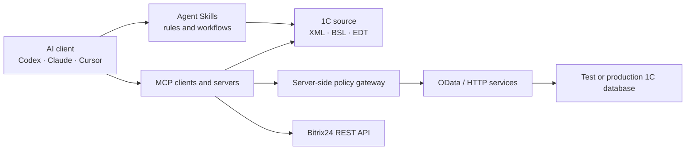

# AI × 1C Guide

**How to connect an AI agent to 1C:Enterprise and Bitrix24 without losing your data.**

An open, community-driven guide to MCP servers, Agent Skills, OData, REST APIs, incoming webhooks, permission boundaries, and reproducible checks.

[Русский](README.md) · **English**

> 1C:Enterprise is an ERP and business-application platform used across Russia and the CIS. Most of its ecosystem documentation exists only in Russian, so this guide is Russian-first. The pages below are available in English.

---

## Start here

| What you want to do | Where to go |
|---|---|
| Let an agent read 1C data over OData | [1C:Fresh → OData: read and test-write](guides/1cfresh-odata.en.md) |
| Read Bitrix24 tasks from a script | [Bitrix24 tasks through an incoming webhook](guides/bitrix24-tasks.en.md) |
| Create leads from a website form | [Bitrix24 leads through a backend webhook](guides/bitrix24-leads.en.md) |
| Reconcile requests, tasks and bugs across three systems | [1C-Connect + Jira + Bitrix24](guides/connect-jira-bitrix24.en.md) |
| Pick an MCP server or Agent Skills setup | [Catalog of 14 projects](#tool-catalog) |
| Understand what an agent may and may not touch | [Minimum security baseline](#minimum-security-baseline) |
| Check what every claim is based on | [Verification matrix](VERIFICATION.md) (in Russian) |

This guide is written for 1C developers (source context, BSL navigation, builds and tests), analysts (controlled data audits), integrators (1C, Bitrix24, and external APIs), and managers who need the line between a pilot and production access.

---

## Real connections

What separates this guide from a list of links: the three scenarios below come from integrations the author actually built, not from other people's READMEs. Each one states separately what was verified and what was not.

### 1C:Fresh over the standard OData interface

A local HTTP client with Basic Auth talks to the `standard.odata` endpoint of a 1C:UNF application in 1C:Fresh: read `$metadata`, list documents with `$select`, `$filter`, and `$top`, fetch a single object by `Ref_Key`, then create an unposted document with duplicate protection.

Author-reported: a private live GET against 1C:UNF. The write path exists in working code but has not been reproduced publicly.

→ [Guide](guides/1cfresh-odata.en.md) · [`scripts/fresh_odata_example.py`](scripts/fresh_odata_example.py)

### Bitrix24 tasks through an incoming webhook

Classic REST: `tasks.task.list` and `tasks.task.get`, `POST application/x-www-form-urlencoded`, `next → start` pagination, bounded retries on rate limits, and `batch` with up to 50 commands. The guide also explains how classic REST differs from REST 3.0 and why the two must not be mixed.

Verified: a working runtime in [`task2bitrix24`](https://github.com/Aleksandr-Litvinenko/task2bitrix24) — tasks, results, logged time, users, and related CRM objects.

→ [Guide](guides/bitrix24-tasks.en.md) · [`scripts/bitrix24_webhook_example.py`](scripts/bitrix24_webhook_example.py)

### Bitrix24 leads from a website form

The correct shape is browser → your HTTPS endpoint → server-side validation → Bitrix24 webhook. The webhook lives on the backend only, because its URL is a password.

Author-reported: a private `crm.lead.add` followed by a `crm.lead.get` that confirmed the stored fields. The public commit documents the architecture; the current example uses the universal `crm.item.add`, which you must verify separately on your own portal.

→ [Guide](guides/bitrix24-leads.en.md) · [`scripts/bitrix24_webhook_example.py`](scripts/bitrix24_webhook_example.py)

### 1C-Connect + Jira + Bitrix24: reconciling three systems

One piece of work lives in three places: the client raises a request in 1C-Connect, a consultant runs a Bitrix24 task, a developer fixes code under a Jira issue. The guide works through how these APIs differ and ships a read-only divergence report.

Three findings that break a naive integration:

- **1C-Connect has no outgoing webhooks** — only polling `ServiceRequestRead` with a watermark you store yourself;
- **the hourly limit is the binding constraint**: 120 calls/hour for the list and just 50 for history, though history accepts a batch of up to 550 IDs; an agent reading history one ticket at a time locks the service out after 50 tickets;
- **Jira Cloud and Data Center are different APIs**: Cloud removed the old `/search` in 2025, Data Center still serves it, and a model will confidently write code for the wrong one.

Verified live: the Jira half, through anonymous calls to the Apache Software Foundation's public Jira, reproducible without an account. 1C-Connect is documented from the official API reference with no live calls.

→ [Guide](guides/connect-jira-bitrix24.en.md) · [`scripts/connect_jira_bridge_example.py`](scripts/connect_jira_bridge_example.py)

Every example is safe by default: read commands cannot call write methods, sensitive output is redacted, and write operations are bound to a fingerprint of the selected endpoint and require separate confirmation. Unit tests run with no real credentials and no network.

---

## First things first: OData is not read-only

The standard 1C OData interface supports more than reads. It can create, update, and delete objects and post documents. An MCP tool name, a system prompt, or a hidden client-side button is not a security boundary.

A read-only setup requires all of the following at once:

1. a dedicated 1C user with no write permissions;
2. a minimal set of published OData entities;
3. a server-side GET-only gateway where needed;
4. negative `POST`, `PATCH`, and `DELETE` tests in a disposable test database;
5. a check that the data did not change.

Primary source: [1C:Enterprise Developer Guide — Standard OData interface](https://kb.1ci.com/1C_Enterprise_Platform/Guides/Developer_Guides/1C_Enterprise_8.3.23_Developer_Guide/Chapter_17._Integration_with_external_systems/17.4._Standard_OData_interface/17.4.1._General_information/?language=en).

---

## Pick a tool in 30 seconds

| Task | Where to start | Boundary you must enforce |
|---|---|---|
| Work with exported source, no database | [cc-1c-skills](https://github.com/Nikolay-Shirokov/cc-1c-skills) | Start from a repository copy; enable load and delete operations separately |
| Read configuration context | [mcp-1c](https://github.com/feenlace/mcp-1c) | An offline dump carries the least risk; a live database also needs an extension and an HTTP service |
| Work inside EDT | [EDT-MCP](https://github.com/DitriXNew/EDT-MCP) | EDT 2026.1/2026.2 only; start with the `Analysis Only` or `Code Review` preset |
| Index a large BSL codebase | [code-index-mcp](https://github.com/Regsorm/code-index-mcp) | Requires `bsl-indexer`; the plain npm/MCP Registry `code-index` binary has no 1C support |
| RAG over configuration structure | [mcp-1c-v1](https://github.com/fserg/mcp-1c-v1) | Python/Docker/Qdrant; it does not index BSL, last push August 2025 |
| Business audit | OData or a purpose-built API | OData is not read-only: deny writes inside 1C and prove it with negative tests |
| 1C and external API integrations | [OpenIntegrations](https://github.com/Bayselonarrend/OpenIntegrations) | Use a Release or `stable`; the universal `execute_method` can modify external systems |
| Bitrix24 REST documentation | [mcp-rest-doc](https://github.com/bitrix24/mcp-rest-doc) | Hosted online service with no published server source; it has no access to your portal |
| Other 1C MCP options | [Awesome 1C MCP Servers](https://github.com/Untru/1c-mcp) | A broad curated list, not a guarantee of completeness or quality |

The full selection logic lives in [guides/choose-stack.md](guides/choose-stack.md) (in Russian).

---

## Architecture map

A safe adoption path has four steps, and each one starts only after the previous is done:

| Step | What the agent gets | What must already be in place |
|---|---|---|
| 1. Source, no data | An exported configuration | A repository copy and no production database |
| 2. Disposable test database | Reads and writes in test | A dedicated user, negative write tests, backup and restore |
| 3. Production, read-only | Bounded GET requests | Server-side denials, an entity allowlist, logging, quotas |
| 4. Data changes | Approved writes | `dry run → preview → human approval → audit log` |

---

## Tool catalog

14 selected projects. The **Checked** column states what was actually done: `Docs` — documentation and author claims reviewed, `Artifact` — release downloaded and inspected, `CLI smoke` — a safe local command was executed, `Live smoke` — a real endpoint responded.

| Project | Scenario | Checked | Key risk or boundary | License |
|---|---|---|---|---|
| [cc-1c-skills](https://github.com/Nikolay-Shirokov/cc-1c-skills) | Full 1C artifact workflow | CLI smoke | Read-write by default; includes load and delete | MIT |
| [OpenIntegrations](https://github.com/Bayselonarrend/OpenIntegrations) | 1C, Bitrix24, and external APIs | Artifact | `execute_method` can modify external services | MIT |
| [EDT-MCP](https://github.com/DitriXNew/EDT-MCP) | 1C:EDT capabilities over MCP | Artifact | `All Tools` enables destructive tools | AGPL-3.0 |
| [1c_mcp](https://github.com/vladimir-kharin/1c_mcp) | Custom MCP tools inside 1C | Docs | Permissions depend on the implementation; no LICENSE file | README claims MIT |
| [1c-mcp-toolkit](https://github.com/ROCTUP/1c-mcp-toolkit) | Metadata, data, MCP/REST | Docs | Arbitrary code execution is available | GPL-3.0 |
| [mcp-1c](https://github.com/feenlace/mcp-1c) | Metadata and dump search | CLI smoke | Live mode needs an extension and an HTTP service; paid editions exist | MIT |
| [mcp-1c-v1](https://github.com/fserg/mcp-1c-v1) | RAG over configuration structure | Docs · stale | Does not index BSL; Docker/Qdrant | MIT |
| [code-index-mcp](https://github.com/Regsorm/code-index-mcp) | Index for large BSL repositories | Docs | 1C support requires a separate `bsl-indexer` | MIT |
| [1c-ai-connector](https://github.com/andromanpro/1c-ai-connector) | LLM, function calling, RAG, and MCP inside 1C | Docs | Custom tool permissions are set by the deployment | MIT |
| [1c-trusted-gateway](https://github.com/alonehobo/1c-trusted-gateway) | Experimental privacy gateway | Docs | Windows-only, no license, arbitrary code execution, no independent audit | Not stated |
| [mcp-rest-doc](https://github.com/bitrix24/mcp-rest-doc) | Hosted Bitrix24 REST documentation | Live smoke | Server source and license are not published; online-only | Not stated |
| [templates-mcp](https://github.com/bitrix24/templates-mcp) | Reference implementation for tasks | Docs · pre-1.0 | Creates, updates, and deletes task data | MIT |
| [bitrix24-mcp](https://github.com/kartochka/bitrix24-mcp) | Contacts, deals, stage changes | Docs · stale | Community project with write access | MIT |
| [Awesome 1C MCP Servers](https://github.com/Untru/1c-mcp) | External curated catalog | Docs | Entry status and quality need re-checking | Not stated |

Every entry in [`catalog/tools.json`](catalog/tools.json) records a pinned commit, license, prerequisites, access surface, known dangerous operations, and evidence links. Star counts are deliberately not stored: they go stale quickly and are no substitute for checking what a tool can reach.

**What the catalog does not have yet:** no 1C tool has passed a full end-to-end test here against a real 1C installation, a test database, and every advertised tool. Per-tool boundaries are in [VERIFICATION.md](VERIFICATION.md) (in Russian).

---

## Minimum security baseline

Before you connect AI to 1C or Bitrix24:

- create a dedicated technical account;
- deny writes inside 1C or the API, not just in the MCP client;
- limit published entities and available server-side operations;
- keep passwords and webhooks out of prompts, READMEs, issues, and logs;
- use a disposable test copy with anonymized data;
- confirm that mutations fail and checksums stay unchanged;
- turn on request and action logging;
- gate writes behind `dry run → preview → human approval`;
- keep a backup and test the restore before you need it;
- confirm where your chosen LLM processes the data.

The full list is in [SECURITY.md](SECURITY.md) (in Russian).

---

## FAQ

### How do I connect Claude or Codex to 1C over OData?

The agent does not reach the database on its own. It writes and runs an ordinary local HTTP client that talks to `standard.odata` over HTTPS with Basic Auth. The password stays in the local process and never goes into a prompt or an MCP configuration. Step by step: [the 1C:Fresh guide](guides/1cfresh-odata.en.md).

### Can 1C access really be read-only?

Yes, but the denial has to live inside 1C: a dedicated user with no write permissions, a minimal set of published objects, and a GET-only gateway where needed. Then run negative `POST`, `PATCH`, and `DELETE` tests in a disposable database — without them, "read-only" is an assumption, not a fact.

### What is the difference between an MCP server and Agent Skills?

An MCP server gives the agent tools and access to an external system over a protocol. Agent Skills are rules and workflows inside the AI client itself, working with files and commands. For an exported configuration, Skills are often enough and no database access is needed at all.

### How do I store a Bitrix24 webhook safely?

An incoming webhook URL is a password carrying the permissions of the user who created it. It belongs in a secret manager or a backend environment variable — never in client-side JavaScript, a repository, an issue, or an AI chat. If it leaked anywhere, reissue it. See [the leads guide](guides/bitrix24-leads.en.md).

### OData, an HTTP service, or an MCP server?

OData is the fastest to enable on a standard configuration, but the platform decides which fields exist. A custom HTTP service gives you an exact contract and server-side validation at the cost of writing and maintaining it. An MCP server is how you hand either option to an agent as a set of tools.

### Does this work with 1C:Fresh, not just an on-premise database?

Yes. In 1C:Fresh the standard OData interface is enabled from the service manager under automatic REST service settings, where the service user and the published objects are configured separately. The address looks like `https://1cfresh.com/a/sbm/<base-id>/odata/standard.odata`.

---

## What this guide covers

**Platform and data:** 1C:Enterprise 8.3, 1C:Fresh, 1C:UNF, the standard OData interface, HTTP services, BSL, configuration export, 1C:EDT.

**Bitrix24:** classic REST API, incoming webhooks, tasks, CRM and leads, rate limits, `batch`.

**AI layer:** MCP (Model Context Protocol), Agent Skills, Claude Code, Codex, Cursor, cloud and local LLMs, function calling, RAG.

**Security:** permission boundaries, least privilege, negative mutation tests, secret storage, logging, rollback.

## What this guide does not do

- It does not declare the listed projects safe or ready for production use.
- It does not treat reading a README or running `--help` as an end-to-end check.
- It does not replace an audit of code, licenses, infrastructure, and permissions.
- It does not recommend giving an LLM administrative rights.
- It does not accept payment for a place in the catalog.

## Contributing

Add a tool, reproduce a smoke test, run a guide on your own stand, or report a limitation you found. Start with [CONTRIBUTING.md](CONTRIBUTING.md) (in Russian). English pull requests and issues are welcome.

Most useful right now:

- end-to-end results on Windows and Linux against a test 1C database;
- exact versions, commands, expected output, and rollback;
- negative mutation tests;
- license, authentication, and secret-storage details;
- confirmed limitations instead of marketing claims.

## Status

Version `v0.4`: adds the three-system chain — 1C-Connect, Jira and Bitrix24 — with the Jira half verified live against a public instance, the 1C-Connect SOAP API documented from the official reference, a local call budget, and a read-only divergence report. Previously in `v0.3`: three connections from the author's own projects, safe-by-default CLI examples, and English versions. Verification boundaries are in [VERIFICATION.md](VERIFICATION.md), and the next tasks are in [ROADMAP.md](ROADMAP.md).

This project is not affiliated with 1C Company or Bitrix24. Product names and trademarks belong to their respective owners.

## License

The text and code in this repository are available under the [MIT License](LICENSE). Listed projects use their own licenses or have no declared license.
