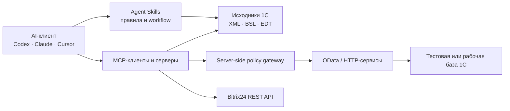

# AI × 1C Guide

**Как подключить AI-агента к «1С:Предприятию» и Bitrix24 — и не потерять данные.**

Открытый гайд на русском языке: MCP-серверы, Agent Skills, OData, REST API, входящие вебхуки, разграничение прав и проверяемые сценарии.

**Русский** · [English](README.en.md)

---

## С чего начать

| Что нужно сделать | Куда идти |
|---|---|
| Дать агенту читать данные 1С через OData | [1С:Фреш → OData: чтение и тестовая запись](guides/1cfresh-odata.md) |
| Прочитать задачи Bitrix24 из скрипта | [Задачи Bitrix24 через входящий вебхук](guides/bitrix24-tasks.md) |
| Создавать лиды из формы сайта | [Лиды Bitrix24 через backend-вебхук](guides/bitrix24-leads.md) |
| Свести заявки, задачи и баги из трёх систем | [1С-Коннект + Jira + Bitrix24](guides/connect-jira-bitrix24.md) |
| Выбрать MCP-сервер или Agent Skills под задачу | [Выбор стека](guides/choose-stack.md) · [каталог из 14 проектов](#каталог-инструментов) |
| Понять, что можно давать агенту, а что нельзя | [Минимальный security baseline](#минимальный-security-baseline) |
| Проверить, на чём основаны утверждения | [Матрица проверок](VERIFICATION.md) |

Гайд полезен 1С-разработчику (контекст исходников, навигация по BSL, сборка и тесты), аналитику (контролируемый аудит данных), интегратору (связки 1С, Bitrix24 и внешних API) и руководителю (граница между пилотом и доступом к рабочей базе).

---

## Реальные подключения

Главное отличие этого гайда от списка ссылок: три сценария ниже собраны не из чужих README, а из интеграций, которые автор делал в своих проектах. Для каждого отдельно указано, что подтверждено фактически, а что осталось непроверенным.

### 1С:Фреш через стандартный OData

Локальный HTTP-клиент с Basic Auth ходит в `standard.odata` приложения «1С:УНФ» в 1С:Фреш: чтение `$metadata`, выборка документов с `$select`, `$filter` и `$top`, чтение одного объекта по `Ref_Key`, затем создание непроведённого документа с защитой от дублей.

Подтверждено автором: приватный live-GET к «1С:УНФ». Запись реализована в рабочем коде, но публично не воспроизводилась.

→ [Инструкция](guides/1cfresh-odata.md) · [`scripts/fresh_odata_example.py`](scripts/fresh_odata_example.py)

### Задачи Bitrix24 через входящий вебхук

Классический REST: `tasks.task.list` и `tasks.task.get`, `POST application/x-www-form-urlencoded`, пагинация `next → start`, ограниченные повторы при лимитах и `batch` до 50 команд. Отдельно разобрано, чем классический REST отличается от REST 3.0 и почему их нельзя смешивать.

Подтверждено: рабочий runtime в [`task2bitrix24`](https://github.com/Aleksandr-Litvinenko/task2bitrix24) — задачи, результаты, списанное время, пользователи и связанные CRM-объекты.

→ [Инструкция](guides/bitrix24-tasks.md) · [`scripts/bitrix24_webhook_example.py`](scripts/bitrix24_webhook_example.py)

### Лиды Bitrix24 из формы сайта

Правильная схема: браузер → ваш HTTPS endpoint → серверная валидация → вебхук Bitrix24. Вебхук живёт только на backend, потому что его URL — это пароль.

Подтверждено автором: приватные `crm.lead.add` и контрольный `crm.lead.get` со сверкой записанных полей. Публичный commit описывает архитектуру; актуальный пример переведён на универсальный `crm.item.add`, который нужно проверить на своём портале отдельно.

→ [Инструкция](guides/bitrix24-leads.md) · [`scripts/bitrix24_webhook_example.py`](scripts/bitrix24_webhook_example.py)

### 1С-Коннект + Jira + Bitrix24: сверка трёх систем

Одна и та же работа живёт в трёх местах: клиент пишет заявку в 1С-Коннект, консультант ведёт задачу в Bitrix24, разработчик правит код по задаче Jira. Инструкция разбирает, чем эти API отличаются друг от друга, и даёт read-only отчёт о расхождениях.

Три вывода, на которых ломается наивная интеграция:

- **у 1С-Коннект нет исходящих вебхуков** — только опрос `ServiceRequestRead` с меткой последнего чтения, которую вы храните сами;
- **часовой лимит — главный ограничитель**: 120 вызовов в час на список и всего 50 на историю, зато история принимает пакет до 550 ID; агент, читающий историю в цикле по одной заявке, блокирует сервис на 50 тикетах;
- **Jira Cloud и Data Center — разные API**: в Cloud старый `/search` отключён в 2025 году, в Data Center он работает, и модель уверенно пишет код не под тот вариант.

Проверено вживую: Jira-часть — анонимными запросами к публичному Jira фонда Apache, воспроизводится без учётной записи. 1С-Коннект описан по официальной документации, live-вызовов не было.

→ [Инструкция](guides/connect-jira-bitrix24.md) · [`scripts/connect_jira_bridge_example.py`](scripts/connect_jira_bridge_example.py)

Все примеры безопасны по умолчанию: команды чтения не умеют вызывать методы записи, чувствительные значения в выводе скрыты, операции записи привязаны к отпечатку выбранного стенда и требуют отдельного подтверждения. Unit-тесты запускаются без реальных секретов и без сети.

---

## Сначала важное: OData не является read-only

Стандартный OData-интерфейс 1С поддерживает не только чтение, но и создание, изменение, удаление объектов и проведение документов. Название MCP tool, системный prompt или скрытая кнопка на стороне клиента не создают границу безопасности.

Для сценария «только чтение» нужны одновременно:

1. отдельный пользователь 1С без прав записи;
2. минимально опубликованный состав OData;
3. при необходимости GET-only gateway на серверной стороне;
4. негативные тесты `POST`, `PATCH` и `DELETE` в одноразовой тестовой базе;
5. сверка, что данные не изменились.

Первоисточник: [1C:Enterprise Developer Guide — Standard OData interface](https://kb.1ci.com/1C_Enterprise_Platform/Guides/Developer_Guides/1C_Enterprise_8.3.23_Developer_Guide/Chapter_17._Integration_with_external_systems/17.4._Standard_OData_interface/17.4.1._General_information/?language=en).

---

## Выбор инструмента за 30 секунд

| Задача | С чего начать | Обязательное ограничение |
|---|---|---|
| Работа с исходниками без базы | [cc-1c-skills](https://github.com/Nikolay-Shirokov/cc-1c-skills) | Начните с копии репозитория; операции загрузки и удаления включайте отдельно |
| Контекст конфигурации | [mcp-1c](https://github.com/feenlace/mcp-1c) | Для минимального риска используйте offline dump; живая база требует расширение и HTTP-сервис |
| Работа из EDT | [EDT-MCP](https://github.com/DitriXNew/EDT-MCP) | Только EDT 2026.1/2026.2; сначала preset `Analysis Only` или `Code Review` |
| Большая BSL-кодовая база | [code-index-mcp](https://github.com/Regsorm/code-index-mcp) | Нужен `bsl-indexer`; обычный npm/MCP Registry бинарник `code-index` не содержит поддержку 1С |
| RAG по структуре конфигурации | [mcp-1c-v1](https://github.com/fserg/mcp-1c-v1) | Python/Docker/Qdrant; это не индексатор BSL, последний push — август 2025 |
| Бизнес-аудит | OData или специальный API | OData не read-only: права запрещаются на стороне 1С и проверяются негативными тестами |
| Интеграции 1С и внешних API | [OpenIntegrations](https://github.com/Bayselonarrend/OpenIntegrations) | Используйте Release/`stable`; универсальный `execute_method` способен менять внешние системы |
| Документация Bitrix24 REST | [mcp-rest-doc](https://github.com/bitrix24/mcp-rest-doc) | Hosted online-сервис без опубликованного server source; не имеет доступа к вашему порталу |
| Другие варианты 1С MCP | [Awesome 1C MCP Servers](https://github.com/Untru/1c-mcp) | Это широкий курируемый список, а не гарантия полноты или качества каждого проекта |

Подробная логика выбора — в [guides/choose-stack.md](guides/choose-stack.md).

---

## Карта архитектуры

Безопасный порядок внедрения — четыре ступени, каждая следующая только после предыдущей:

| Ступень | Что получает агент | Что должно быть готово |
|---|---|---|
| 1. Исходники без данных | Выгрузку конфигурации | Копия репозитория, никакой рабочей базы |
| 2. Одноразовая тестовая база | Чтение и запись в тесте | Отдельный пользователь, негативные тесты записи, backup и restore |
| 3. Рабочая база, только чтение | Ограниченный GET | Серверные запреты, allowlist объектов, журналирование, лимиты |
| 4. Изменение данных | Запись по согласованию | Режим `dry-run → preview → подтверждение человеком → audit log` |

---

## Практические маршруты

**AI помогает разрабатывать в 1С.** Начните с [инструкции по разработке](guides/ai-assisted-development.md): сначала исходники, затем статический анализ и тесты, и только потом подключение к тестовой базе. Для `EDT-MCP` не оставляйте preset `All Tools` по умолчанию — он включает запись, обновление базы и удаление объектов.

**AI делает управленческий аудит.** Начните с [read-only аудита](guides/read-only-business-audit.md), затем пройдите [реальное подключение к OData в 1С:Фреш](guides/1cfresh-odata.md). Зафиксируйте эталонный отчёт, контрольные суммы и негативные тесты записи до доступа к рабочим данным.

**AI работает с Bitrix24.** Начните с [обзора Bitrix24](guides/bitrix24-assistant.md), затем выберите [чтение задач](guides/bitrix24-tasks.md) или [создание лидов через backend](guides/bitrix24-leads.md). Разделяйте MCP документации и runtime-коннектор: первый знает методы, второй получает ограниченные права конкретного портала.

**AI сводит данные из нескольких систем.** Начните со [связки 1С-Коннект, Jira и Bitrix24](guides/connect-jira-bitrix24.md). Сначала read-only отчёт о расхождениях и явный внешний ключ, и только потом любые попытки автосоздания: ошибка сопоставления, размноженная по трём системам, дороже той работы, которую она экономит.

---

## Каталог инструментов

14 отобранных проектов. Столбец «Проверка» показывает, что реально сделано: `Docs` — изучены документация и заявления автора, `Artifact` — скачан и проверен релиз, `CLI smoke` — выполнена безопасная локальная команда, `Live smoke` — ответил реальный endpoint.

| Проект | Сценарий | Проверка | Ключевой риск или граница | Лицензия |
|---|---|---|---|---|
| [cc-1c-skills](https://github.com/Nikolay-Shirokov/cc-1c-skills) | Полный workflow артефактов 1С | CLI smoke | По умолчанию read-write; есть загрузка и удаление | MIT |
| [OpenIntegrations](https://github.com/Bayselonarrend/OpenIntegrations) | 1С, Bitrix24 и внешние API | Artifact | `execute_method` может менять внешние сервисы | MIT |
| [EDT-MCP](https://github.com/DitriXNew/EDT-MCP) | Возможности 1C:EDT через MCP | Artifact | `All Tools` включает destructive tools | AGPL-3.0 |
| [1c_mcp](https://github.com/vladimir-kharin/1c_mcp) | Собственные MCP tools внутри 1С | Docs | Права зависят от реализации; LICENSE-файла нет | README заявляет MIT |
| [1c-mcp-toolkit](https://github.com/ROCTUP/1c-mcp-toolkit) | Метаданные, данные, MCP/REST | Docs | Доступно произвольное выполнение кода | GPL-3.0 |
| [mcp-1c](https://github.com/feenlace/mcp-1c) | Метаданные и поиск по dump | CLI smoke | Для live-режима нужны расширение и HTTP-сервис; есть платные редакции | MIT |
| [mcp-1c-v1](https://github.com/fserg/mcp-1c-v1) | RAG структуры конфигурации | Docs · stale | Не индексирует BSL; Docker/Qdrant | MIT |
| [code-index-mcp](https://github.com/Regsorm/code-index-mcp) | Индекс больших BSL-репозиториев | Docs | Для 1С нужен отдельный `bsl-indexer` | MIT |
| [1c-ai-connector](https://github.com/andromanpro/1c-ai-connector) | LLM, function calling, RAG и MCP внутри 1С | Docs | Права custom tools задаёт внедрение | MIT |
| [1c-trusted-gateway](https://github.com/alonehobo/1c-trusted-gateway) | Экспериментальный privacy gateway | Docs | Windows-only, нет лицензии, есть arbitrary code execution, нет независимого аудита | Не указана |
| [mcp-rest-doc](https://github.com/bitrix24/mcp-rest-doc) | Hosted документация Bitrix24 REST | Live smoke | Server source и лицензия не опубликованы; online-only | Не указана |
| [templates-mcp](https://github.com/bitrix24/templates-mcp) | Reference implementation для задач | Docs · pre-1.0 | Создание, изменение и удаление данных задач | MIT |
| [bitrix24-mcp](https://github.com/kartochka/bitrix24-mcp) | Контакты, сделки, смена стадии | Docs · stale | Community-проект с write access | MIT |
| [Awesome 1C MCP Servers](https://github.com/Untru/1c-mcp) | Внешний курируемый каталог | Docs | Статус и качество записей нужно перепроверять | Не указана |

Для каждой записи в [`catalog/tools.json`](catalog/tools.json) зафиксированы commit, лицензия, prerequisites, поверхность доступа, известные опасные операции и ссылки на доказательства. Звёзды намеренно не хранятся: они быстро устаревают и не заменяют проверку прав доступа.

**Чего в каталоге пока нет:** ни один 1С-инструмент не прошёл здесь полный end-to-end тест с реальной 1С, тестовой базой и всеми заявленными tools. Границы каждой проверки — в [VERIFICATION.md](VERIFICATION.md).

---

## Минимальный security baseline

Перед подключением AI к 1С или Bitrix24:

- создайте отдельную техническую учётную запись;
- запретите запись на стороне 1С или API, а не только в MCP-клиенте;
- ограничьте опубликованные сущности и доступные server-side operations;
- не передавайте пароли и вебхуки в prompt, README, issue и логи;
- используйте одноразовую тестовую копию с обезличенными данными;
- проверьте отказ мутаций и неизменность контрольных сумм;
- включите журналирование запросов и действий;
- для записи используйте `dry-run → preview → подтверждение человеком`;
- храните резервную копию и заранее проверьте восстановление;
- уточните, где обрабатываются данные выбранной LLM.

Полный список — в [SECURITY.md](SECURITY.md).

---

## Частые вопросы

### Как подключить Claude или Codex к 1С через OData?

Агент не подключается к базе сам. Он пишет и запускает обычный локальный HTTP-клиент, который ходит в `standard.odata` по HTTPS с Basic Auth. Пароль знает локальный процесс, и его не нужно вставлять в prompt или конфигурацию MCP. Пошагово — в [инструкции по 1С:Фреш](guides/1cfresh-odata.md).

### Можно ли сделать доступ к 1С только на чтение?

Да, но запрет должен стоять на стороне 1С: отдельный пользователь без прав записи, минимальный состав опубликованных объектов, при необходимости GET-only gateway. После настройки обязательны негативные тесты `POST`, `PATCH` и `DELETE` в одноразовой базе — иначе «только чтение» остаётся предположением.

### Чем MCP-сервер отличается от Agent Skills?

MCP-сервер даёт агенту инструменты и доступ к внешней системе по протоколу. Agent Skills — это правила и workflow внутри самого AI-клиента, работающие с файлами и командами. Для работы с выгрузкой конфигурации часто достаточно Skills, и доступ к базе не нужен вовсе.

### Как безопасно хранить вебхук Bitrix24?

URL входящего вебхука — это пароль с правами создавшего его пользователя. Он должен жить только в secret manager или переменной окружения на backend, никогда в клиентском JavaScript, репозитории, issue или AI-чате. Если он куда-то попал, вебхук нужно перевыпустить. Подробнее — в [инструкции по лидам](guides/bitrix24-leads.md).

### Что выбрать: OData, HTTP-сервис или MCP-сервер?

OData быстрее всего поднять на типовой конфигурации, но состав полей задаёт платформа. Собственный HTTP-сервис даёт точный контракт и серверную валидацию, но его нужно писать и поддерживать. MCP-сервер — способ отдать любой из этих вариантов агенту как набор инструментов. Разбор компромиссов — в [выборе стека](guides/choose-stack.md).

### Работает ли это с 1С:Фреш, а не только с локальной базой?

Да. В 1С:Фреш стандартный OData включается в менеджере сервиса через «Настройка автоматического REST-сервиса», где отдельно задаются служебный пользователь и состав объектов. Адрес имеет вид `https://1cfresh.com/a/sbm/<base-id>/odata/standard.odata`.

---

## Что покрывает гайд

**Платформа и данные:** «1С:Предприятие» 8.3, 1С:Фреш, 1С:УНФ, стандартный OData-интерфейс, HTTP-сервисы, BSL, выгрузка конфигурации, 1C:EDT.

**Bitrix24:** классический REST API, входящие вебхуки, задачи, CRM и лиды, ограничения запросов, `batch`.

**AI-слой:** MCP (Model Context Protocol), Agent Skills, Claude Code, Codex, Cursor, облачные и локальные LLM, function calling, RAG.

**Безопасность:** разграничение прав, least privilege, негативные тесты мутаций, хранение секретов, журналирование, откат.

## Что этот гайд не делает

- Не объявляет перечисленные проекты безопасными или готовыми к промышленной эксплуатации.
- Не приравнивает чтение README или запуск `--help` к end-to-end проверке.
- Не заменяет аудит кода, лицензии, инфраструктуры и прав.
- Не рекомендует давать LLM административные права.
- Не принимает оплату за место в каталоге.

## Как помочь

Можно добавить инструмент, воспроизвести smoke-test, проверить инструкцию на своём стенде или прислать найденное ограничение. Начните с [CONTRIBUTING.md](CONTRIBUTING.md).

Особенно нужны:

- end-to-end результаты на Windows и Linux с тестовой 1С;
- точные версии, команды, ожидаемый вывод и откат;
- негативные тесты мутаций;
- сведения о лицензии, авторизации и хранении секретов;
- подтверждённые ограничения вместо рекламных формулировок.

## Статус

Версия `v0.4`: добавлена связка трёх систем — 1С-Коннект, Jira и Bitrix24 — с живой проверкой Jira-части на публичном инстансе, разбором SOAP-API 1С-Коннект по официальной документации, локальным бюджетом вызовов и read-only отчётом о расхождениях. Ранее в `v0.3`: три подключения из проектов автора, безопасные по умолчанию CLI-примеры и английские версии. Границы проверок — в [VERIFICATION.md](VERIFICATION.md), следующие задачи — в [ROADMAP.md](ROADMAP.md).

Проект не аффилирован с фирмой «1С» или Bitrix24. Названия и товарные знаки принадлежат их правообладателям.

## Лицензия

Текст и код этого репозитория доступны по лицензии [MIT](LICENSE). У перечисленных проектов собственные лицензии или отсутствие явной лицензии.
