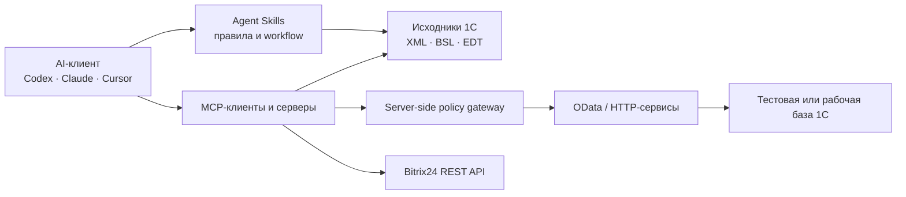

# AI × 1C Guide

Практический open-source гайд по применению AI в экосистеме 1С:Предприятия: Agent Skills, MCP, OData, интеграции, безопасность и проверяемые сценарии.

[English summary](README.en.md) · [Реальные подключения](#реальные-подключения) · [Как всё проверялось](VERIFICATION.md) · [Каталог v2](catalog/tools.json) · [Выбрать стек](recipes/choose-stack.md) · [Предложить проект](CONTRIBUTING.md)

> Это карта выбора, а не рейтинг, сертификация или гарантия безопасности. Уровень проверки каждого проекта указан отдельно: изучение документации, проверка релизного артефакта, CLI/live smoke-test или end-to-end.

## Что подтверждено на 8 августа 2026

- 14/14 репозиториев существуют, публичны и не архивированы.
- Для каждого проекта зафиксированы commit, лицензия, prerequisites, поверхность доступа и известные опасные операции.
- `cc-1c-skills` и `mcp-1c` прошли локальные CLI smoke-tests на macOS.
- Релизные артефакты `EDT-MCP` и `OpenIntegrations` скачаны и проверены, но не запускались внутри EDT/1С.
- Hosted Bitrix24 docs MCP отвечает: `initialize`, `tools/list`, поиск и получение деталей метода прошли.
- Внутренние Markdown-ссылки, JSON schema v2 и формулировки риска проверяются CI.

**Не подтверждено:** ни один 1С-инструмент не прошёл здесь полный end-to-end тест с реальной 1С, Windows/Linux, тестовой базой и всеми заявленными tools. Подробная матрица — в [VERIFICATION.md](VERIFICATION.md).

## Кому пригодится

- **1С-разработчику** — выбрать контекст исходников, навигацию по BSL, сборку и тестирование.
- **Аналитику** — спроектировать контролируемый аудит данных через OData или специальный API.
- **Руководителю** — отделить полезный pilot от неоправданного доступа к production.
- **Интегратору** — сравнить связки для 1С, Bitrix24, внешних API и локальных моделей.

## Сначала важное: OData не является read-only

Стандартный OData-интерфейс 1С поддерживает не только чтение, но и создание, изменение, удаление объектов и проведение документов. Название MCP tool, системный prompt или скрытие кнопки на стороне клиента не создают границу безопасности.

Для read-only сценария нужны одновременно:

1. отдельный пользователь 1С без прав записи;
2. минимально опубликованный состав OData;
3. при необходимости GET-only gateway на серверной стороне;
4. негативные тесты `POST`/`PATCH`/`DELETE` в одноразовой тестовой базе;
5. сверка, что данные не изменились.

Первоисточник: [1C:Enterprise Developer Guide — Standard OData interface](https://kb.1ci.com/1C_Enterprise_Platform/Guides/Developer_Guides/1C_Enterprise_8.3.23_Developer_Guide/Chapter_17._Integration_with_external_systems/17.4._Standard_OData_interface/17.4.1._General_information/?language=en).

## Выбор за 30 секунд

| Задача | С чего начать | Обязательное ограничение |
|---|---|---|
| Работа с исходниками без базы | [cc-1c-skills](https://github.com/Nikolay-Shirokov/cc-1c-skills) | Начните с копии репозитория; операции загрузки и удаления включайте отдельно |
| Контекст конфигурации | [mcp-1c](https://github.com/feenlace/mcp-1c) | Для минимального риска используйте offline dump; живая база требует расширение и HTTP-сервис |
| Работа из EDT | [EDT-MCP](https://github.com/DitriXNew/EDT-MCP) | Только EDT 2026.1/2026.2; сначала preset `Analysis Only` или `Code Review` |
| Большая BSL-кодовая база | [code-index-mcp](https://github.com/Regsorm/code-index-mcp) | Нужен `bsl-indexer`; обычный npm/MCP Registry бинарник `code-index` не содержит поддержку 1С |
| RAG по структуре конфигурации | [mcp-1c-v1](https://github.com/fserg/mcp-1c-v1) | Python/Docker/Qdrant; это не индексатор BSL, последний push — август 2025 |
| Бизнес-аудит | OData или специальный API | OData не read-only: права запрещаются на стороне 1С и проверяются негативными тестами |
| Интеграции 1С и внешних API | [OpenIntegrations](https://github.com/Bayselonarrend/OpenIntegrations) | Используйте Release/`stable`; универсальный `execute_method` способен менять внешние системы |
| Документация Bitrix24 REST | [mcp-rest-doc](https://github.com/bitrix24/mcp-rest-doc) | Hosted online-сервис без опубликованного server source; не имеет доступа к вашему порталу |
| Другие варианты 1С MCP | [Awesome 1C MCP Servers](https://github.com/Untru/1c-mcp) | Это широкий курируемый список, а не гарантия полноты или качества каждого проекта |

Подробная логика выбора: **[recipes/choose-stack.md](recipes/choose-stack.md)**.

## Карта архитектуры

Самая безопасная последовательность внедрения:

1. **Исходники без данных** — AI работает с выгрузкой конфигурации.
2. **Одноразовая тестовая база** — отдельный пользователь, негативные тесты записи, backup/restore.
3. **Рабочая база, только чтение** — серверные запреты, allowlist объектов, журналирование, лимиты.
4. **Изменения данных** — отдельный режим `dry-run → preview → human approval → audit log`.

## Реальные подключения

Эти рецепты основаны не только на чужих README, а на интеграциях, которые использовались в проектах автора. Статус чтения и записи указан раздельно.

| Сценарий | Что реально подтверждено | Рецепт |
|---|---|---|
| 1С:Фреш через OData | Подтверждённый автором private live-GET к 1С:УНФ; write-flow реализован, но публично не воспроизводился | [Чтение и тестовое создание документов](recipes/1cfresh-odata.md) |
| Задачи Bitrix24 | Рабочий classic REST runtime в `task2bitrix24`: список, результаты, время, пользователи и связанные CRM-объекты | [Список задач и карточка по ID](recipes/bitrix24-tasks.md) |
| Лиды Bitrix24 | Автором подтверждены private `crm.lead.add` и контрольный `crm.lead.get`; публичный commit описывает архитектуру, новый рецепт использует universal API | [Backend webhook и создание лида](recipes/bitrix24-leads.md) |

Готовые безопасные по умолчанию примеры находятся в [`scripts/fresh_odata_example.py`](scripts/fresh_odata_example.py) и [`scripts/bitrix24_webhook_example.py`](scripts/bitrix24_webhook_example.py). Операции записи привязаны к отпечатку выбранного стенда и требуют отдельного подтверждения; чувствительные значения в выводе скрыты по умолчанию.

## Практические маршруты

### AI помогает разрабатывать в 1С

Начните с [инструкции разработки](recipes/ai-assisted-development.md): сначала исходники, затем статический анализ и тесты, и только потом подключение к тестовой базе. Для `EDT-MCP` не оставляйте preset `All Tools` по умолчанию: он включает запись, обновление базы и удаление объектов.

### AI делает управленческий аудит

Начните с [read-only аудита](recipes/read-only-business-audit.md), затем пройдите [реальное подключение к OData в 1С:Фреш](recipes/1cfresh-odata.md). Зафиксируйте эталонный отчёт, контрольные суммы и негативные тесты записи до доступа к рабочим данным.

### AI работает с Bitrix24

Начните с [инструкции Bitrix24](recipes/bitrix24-assistant.md), затем выберите [чтение задач](recipes/bitrix24-tasks.md) или [создание лидов через backend](recipes/bitrix24-leads.md). Разделяйте MCP документации и runtime-коннектор: первый знает методы, второй получает ограниченные права конкретного портала.

## Отобранные проекты

| Проект | Сценарий | Проверка | Ключевой риск или граница | Лицензия |
|---|---|---|---|---|
| [cc-1c-skills](https://github.com/Nikolay-Shirokov/cc-1c-skills) | Полный workflow артефактов 1С | CLI smoke | По умолчанию read-write; есть загрузка и удаление | MIT |
| [OpenIntegrations](https://github.com/Bayselonarrend/OpenIntegrations) | 1С, Bitrix24 и внешние API | Artifact | `execute_method` может менять внешние сервисы | MIT |
| [EDT-MCP](https://github.com/DitriXNew/EDT-MCP) | Возможности 1C:EDT через MCP | Artifact | `All Tools` включает destructive tools | AGPL-3.0 |
| [1c_mcp](https://github.com/vladimir-kharin/1c_mcp) | Собственные MCP tools внутри 1С | Docs | Права зависят от реализации; LICENSE-файла нет | README заявляет MIT |
| [1c-mcp-toolkit](https://github.com/ROCTUP/1c-mcp-toolkit) | Метаданные, данные, MCP/REST | Docs | Доступно произвольное выполнение кода | GPL-3.0 |
| [mcp-1c](https://github.com/feenlace/mcp-1c) | Метаданные и поиск по dump | CLI smoke | Для live-режима нужны расширение и HTTP-сервис; есть платные редакции | MIT |
| [mcp-1c-v1](https://github.com/fserg/mcp-1c-v1) | RAG структуры конфигурации | Docs · stale | Не индексирует BSL; Docker/Qdrant | MIT |
| [code-index-mcp](https://github.com/Regsorm/code-index-mcp) | Индекс больших BSL-репозиториев | Docs | Для 1С нужен отдельный `bsl-indexer` | MIT |
| [1c-ai-connector](https://github.com/andromanpro/1c-ai-connector) | LLM, function calling, RAG и MCP внутри 1С | Docs | Права custom tools задаёт внедрение | MIT |
| [1c-trusted-gateway](https://github.com/alonehobo/1c-trusted-gateway) | Экспериментальный privacy gateway | Docs | Windows-only, нет лицензии, есть arbitrary code execution, нет независимого аудита | Не указана |
| [mcp-rest-doc](https://github.com/bitrix24/mcp-rest-doc) | Hosted документация Bitrix24 REST | Live smoke | Server source и лицензия не опубликованы; online-only | Не указана |
| [templates-mcp](https://github.com/bitrix24/templates-mcp) | Reference implementation для задач | Docs · pre-1.0 | Создание, изменение и удаление данных задач | MIT |
| [bitrix24-mcp](https://github.com/kartochka/bitrix24-mcp) | Контакты, сделки, смена стадии | Docs · stale | Community-проект с write access | MIT |
| [Awesome 1C MCP Servers](https://github.com/Untru/1c-mcp) | Внешний курируемый каталог | Docs | Статус и качество записей нужно перепроверять | Не указана |

Полные prerequisites, зафиксированные commits, evidence URLs и списки операций находятся в [`catalog/tools.json`](catalog/tools.json). Звёзды намеренно не хранятся: они быстро устаревают и не заменяют проверку доступа.

## Минимальный security baseline

Перед подключением AI к 1С или Bitrix24:

- создайте отдельную техническую учётную запись;
- запретите запись на стороне 1С/API, а не только в MCP-клиенте;
- ограничьте опубликованные сущности и доступные server-side operations;
- не передавайте пароли в prompt, README, issue и логи;
- используйте одноразовую тестовую копию с обезличенными данными;
- проверьте отказ мутаций и неизменность контрольных сумм;
- включите журналирование запросов и действий;
- для записи используйте `dry-run → preview → human approval`;
- храните резервную копию и заранее проверьте восстановление;
- уточните, где обрабатываются данные выбранной LLM.

Полный список: **[SECURITY.md](SECURITY.md)**.

## Что этот гайд не делает

- Не объявляет перечисленные проекты безопасными или готовыми к production.
- Не приравнивает чтение README или запуск `--help` к end-to-end проверке.
- Не заменяет аудит кода, лицензии, инфраструктуры и прав.
- Не рекомендует давать LLM административные права.
- Не принимает оплату за место в каталоге.

## Как помочь

Можно добавить инструмент, воспроизвести smoke-test, проверить рецепт на тестовом стенде или прислать ограничение. Начните с [CONTRIBUTING.md](CONTRIBUTING.md).

Особенно нужны:

- end-to-end результаты на Windows/Linux с тестовой 1С;
- точные версии, команды, expected output и rollback;
- негативные тесты мутаций;
- сведения о лицензии, auth и secret storage;
- подтверждённые ограничения вместо рекламных формулировок.

## Статус

Версия `v0.3` добавляет три практических подключения из проектов автора, безопасные CLI-примеры и unit-тесты без реальных секретов или production-записи. Границы live-проверок опубликованы в [VERIFICATION.md](VERIFICATION.md), следующие задачи — в [ROADMAP.md](ROADMAP.md).

Проект не аффилирован с фирмой «1С» или Bitrix24. Названия и товарные знаки принадлежат их правообладателям.

## Лицензия

Текст и код этого репозитория доступны по лицензии [MIT](LICENSE). У перечисленных проектов собственные лицензии или отсутствие явной лицензии.
