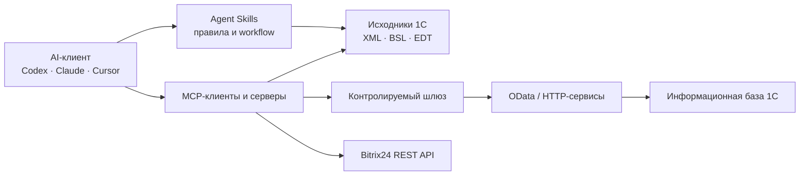

# AI × 1C Guide

Практический open-source гайд по применению AI в экосистеме 1С:Предприятия: Agent Skills, MCP, OData, интеграции, безопасность и проверяемые сценарии.

[English summary](README.en.md) · [Каталог инструментов](catalog/tools.json) · [Выбрать стек](recipes/choose-stack.md) · [Предложить проект](CONTRIBUTING.md)

> Цель гайда — помочь выбрать минимальный безопасный стек под задачу. Это не рейтинг и не знак сертификации: перед использованием проверяйте исходный код, лицензию и модель доступа каждого проекта.

## Кому пригодится

- **1С-разработчику** — дать агенту контекст конфигурации, навигацию по BSL, сборку и тестирование.
- **Аналитику** — безопасно читать данные 1С через OData и собирать управленческие отчёты.
- **Руководителю** — понять, где AI действительно сокращает ручную работу, а где создаёт лишний риск.
- **Интегратору** — выбрать связку для 1С, Bitrix24, внешних API и локальных моделей.

## Выбор за 30 секунд

| Задача | С чего начать | Почему |
|---|---|---|
| Агент создаёт и изменяет артефакты 1С | [cc-1c-skills](https://github.com/Nikolay-Shirokov/cc-1c-skills) | Навыки для полного цикла разработки, есть варианты для Claude Code, Cursor и Codex |
| Нужен контекст живой базы и метаданных | [mcp-1c](https://github.com/feenlace/mcp-1c), [1c_mcp](https://github.com/vladimir-kharin/1c_mcp) | MCP-инструменты для работы с конфигурацией и базой |
| Основная среда — 1C:EDT | [EDT-MCP](https://github.com/DitriXNew/EDT-MCP) | Мост между AI-агентом и возможностями EDT |
| Нужно разбирать большую кодовую базу | [code-index-mcp](https://github.com/Regsorm/code-index-mcp), [mcp-1c-v1](https://github.com/fserg/mcp-1c-v1) | Индексация, поиск и контекст по BSL/метаданным |
| Нужна бизнес-аналитика без доработки конфигурации | OData + read-only MCP | Подходит для облачной, серверной и файловой базы с опубликованным OData |
| Нужен защищённый шлюз к данным | [1c-trusted-gateway](https://github.com/alonehobo/1c-trusted-gateway) | Отдельный слой контроля и маскирования данных |
| Нужны интеграции с Bitrix24 и внешними API | [OpenIntegrations](https://github.com/Bayselonarrend/OpenIntegrations) | Большая библиотека интеграций для 1С, OneScript и CLI/MCP |
| AI должен знать актуальный Bitrix24 REST API | [mcp-rest-doc](https://github.com/bitrix24/mcp-rest-doc) | Официальный MCP-сервер документации Bitrix24 |
| Нужен полный технический каталог MCP для 1С | [Awesome 1C MCP Servers](https://github.com/Untru/1c-mcp) | Подробный отраслевой список серверов и архитектурных паттернов |

Подробная логика выбора: **[recipes/choose-stack.md](recipes/choose-stack.md)**.

## Карта архитектуры



Самая безопасная последовательность внедрения:

1. **Исходники без данных** — AI работает с выгрузкой конфигурации.
2. **Тестовая база, только чтение** — отдельный пользователь и ограниченный состав OData.
3. **Рабочая база, только чтение** — allowlist объектов, журналирование, лимиты.
4. **Изменения данных** — только через dry-run, явное подтверждение и аудит действий.

## Практические маршруты

### AI помогает разрабатывать в 1С

Начните с [инструкции разработки](recipes/ai-assisted-development.md). Базовая связка:

```text
Agent Skills → контекст исходников/метаданных → проверка BSL → тесты → review человеком
```

Не начинайте с доступа к рабочим данным: для генерации и review кода они обычно не нужны.

### AI делает управленческий аудит

Начните с [read-only аудита](recipes/read-only-business-audit.md). Хороший первый сценарий:

- дебиторская задолженность;
- просроченные оплаты;
- отрицательные остатки;
- задачи без результата или списанного времени;
- аномалии выручки и закупок.

Сначала зафиксируйте контрольные суммы и сравните результат AI с отчётом 1С на небольшом периоде.

### AI работает с Bitrix24

Начните с [инструкции Bitrix24](recipes/bitrix24-assistant.md). Разделяйте два слоя:

- официальный MCP документации помогает агенту выбирать правильные REST-методы;
- runtime-коннектор выполняет запросы к конкретному порталу с минимальными правами.

## Отобранные проекты

| Проект | Основной сценарий | Технология | Лицензия |
|---|---|---|---|
| [cc-1c-skills](https://github.com/Nikolay-Shirokov/cc-1c-skills) | Полный цикл AI-assisted разработки | Python / PowerShell | MIT |
| [OpenIntegrations](https://github.com/Bayselonarrend/OpenIntegrations) | Интеграции 1С и внешних сервисов | 1C Enterprise | MIT |
| [EDT-MCP](https://github.com/DitriXNew/EDT-MCP) | Управление 1C:EDT через MCP | Java | AGPL-3.0 |
| [1c_mcp](https://github.com/vladimir-kharin/1c_mcp) | Создание MCP-инструментов внутри 1С | 1C Enterprise / Python | Не указана |
| [1c-mcp-toolkit](https://github.com/ROCTUP/1c-mcp-toolkit) | Метаданные и данные через MCP/REST | 1C Enterprise | GPL-3.0 |
| [mcp-1c](https://github.com/feenlace/mcp-1c) | Контекст конфигурации и генерация BSL | Go | MIT |
| [mcp-1c-v1](https://github.com/fserg/mcp-1c-v1) | RAG по структуре конфигурации | TypeScript | MIT |
| [code-index-mcp](https://github.com/Regsorm/code-index-mcp) | Индексация и анализ больших BSL-репозиториев | Rust | MIT |
| [1c-ai-connector](https://github.com/andromanpro/1c-ai-connector) | LLM, function calling, RAG и MCP внутри 1С | 1C Enterprise | MIT |
| [1c-trusted-gateway](https://github.com/alonehobo/1c-trusted-gateway) | Маскирование и контролируемый доступ | Go | Не указана |
| [mcp-rest-doc](https://github.com/bitrix24/mcp-rest-doc) | Актуальная документация Bitrix24 REST | MCP | Не указана |
| [templates-mcp](https://github.com/bitrix24/templates-mcp) | Шаблон production-grade MCP для Bitrix24 | TypeScript | MIT |
| [bitrix24-mcp](https://github.com/kartochka/bitrix24-mcp) | Работа с Bitrix24 на естественном языке | Python | MIT |
| [Awesome 1C MCP Servers](https://github.com/Untru/1c-mcp) | Полный технический каталог | Markdown | Не указана |

Машиночитаемые данные и дата последней проверки находятся в [`catalog/tools.json`](catalog/tools.json). Звёзды намеренно не хранятся: они быстро устаревают и не заменяют проверку безопасности.

## Минимальный security baseline

Перед подключением AI к 1С или Bitrix24:

- создайте отдельную техническую учётную запись;
- выдайте только необходимые права, по умолчанию — чтение;
- ограничьте объекты OData и доступные MCP tools;
- не передавайте пароли в промптах, README, issue и логах;
- используйте тестовую копию и обезличенные данные для первого запуска;
- включите журналирование запросов и изменений;
- для записи используйте `dry-run → preview → human approval`;
- храните резервную копию и заранее проверьте восстановление;
- уточните, где обрабатываются данные выбранной LLM.

Полный список: **[SECURITY.md](SECURITY.md)**.

## Что этот гайд не делает

- Не объявляет проекты безопасными или готовыми к production.
- Не заменяет аудит кода, лицензии и инфраструктуры.
- Не рекомендует давать LLM административные права.
- Не публикует закрытые материалы 1С или персональные данные.
- Не принимает оплату за место в каталоге.

## Как помочь

Можно добавить инструмент, уточнить сценарий, проверить инструкцию или предложить безопасный пример. Начните с [CONTRIBUTING.md](CONTRIBUTING.md) или откройте issue по шаблону.

Особенно полезны:

- воспроизводимые инструкции установки;
- примеры с тестовыми данными;
- сравнения ограничений, а не рекламные тексты;
- сведения о лицензии и модели доступа;
- результаты проверки на Windows, Linux и macOS.

## Статус

Гид запущен в августе 2026 года и развивается итерациями. Ближайшие задачи опубликованы в [ROADMAP.md](ROADMAP.md).

Проект не аффилирован с фирмой «1С» или Bitrix24. Названия и товарные знаки принадлежат их правообладателям.

## Лицензия

Текст и код этого репозитория доступны по лицензии [MIT](LICENSE). У перечисленных проектов собственные лицензии.
